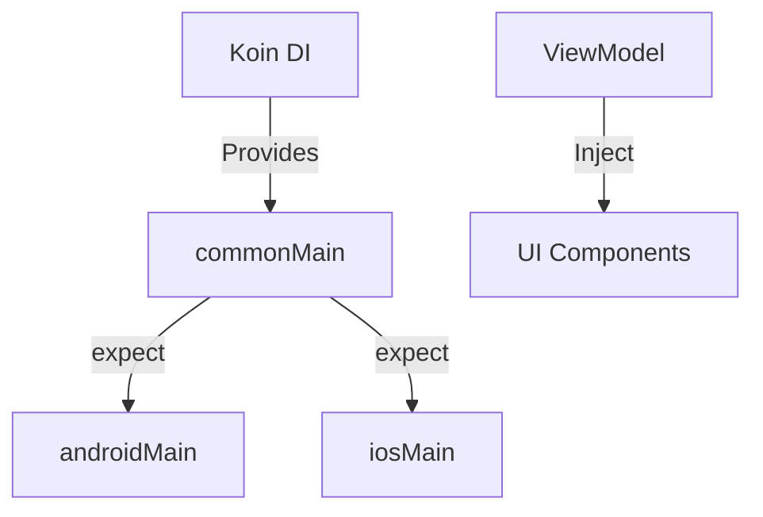

# 📓 Aurora Glass Notes App - Platform-Specific Features Implementation

**Tugas Praktikum Minggu 8 — IF25-22017 Pengembangan Aplikasi Mobile** **Program Studi Teknik Informatika · Institut Teknologi Sumatera**

---

## 👤 Identitas Mahasiswa
* **Nama**: Garis Rayya Rabbani
* **NIM**: 123140018
* **Kelas**: IF25-22017
* **Mata Kuliah**: Pengembangan Aplikasi Mobile (PAM)

---

## 📋 Ringkasan Implementasi
Proyek ini merupakan pembaruan dari *Notes App* dengan fokus pada integrasi fitur spesifik platform (Native APIs) menggunakan pola **expect/actual** dan implementasi **Dependency Injection (DI)** menggunakan **Koin**. Arsitektur aplikasi dirancang untuk memisahkan logika bisnis dari implementasi platform-specific guna menjaga kode tetap bersih dan mudah diuji.

---

## 🛠️ Detail Teknis & Kepatuhan Rubrik

### 1. Dependency Injection dengan Koin (Bobot: 25%)
Seluruh manajemen objek sekarang dikelola secara terpusat melalui Koin untuk menghindari *tight coupling*.
* **`commonModule`**: Mengelola Singleton untuk `AppDatabase`, `NoteRepository`, dan `NewsRepository`.
* **`platformModule`**: Mengelola *platform-specific services* seperti `DeviceInfo`, `NetworkMonitor`, dan `BatteryInfo`.
* **Injection Strategy**: Menggunakan `viewModelOf` untuk instansiasi ViewModel otomatis dan `koinViewModel()` / `koinInject()` pada level UI.

### 2. Pola expect/actual (Bobot: 25%)
Implementasi API native yang berbeda di setiap platform namun tetap memiliki akses API yang seragam di kode bersama (*commonMain*).
* **`DeviceInfo`**: Mengambil data model dan versi OS menggunakan `Build` API di Android dan `UIDevice` di iOS.
* **`NetworkMonitor`**: Memantau status konektivitas secara reaktif menggunakan `ConnectivityManager` (Android) dan `NWPathMonitor` (iOS).
* **Bonus (+10%)**: Implementasi **`BatteryInfo`** untuk memantau persentase daya dan status pengisian daya perangkat.

### 3. Integrasi UI & UX (Bobot: 20%)
* **Settings Screen**: Menampilkan kartu informasi perangkat yang mencakup model, versi OS, serta status baterai *real-time*.
* **Network Status Indicator**: Komponen reaktif pada layar utama yang muncul dengan animasi *smooth* saat perangkat terdeteksi *offline*.

### 4. Arsitektur & Kualitas Kode (Bobot: 30%)
* **Separation of Concerns**: Pemisahan yang jelas antara lapisan data, domain, dan presentasi.
* **Clean Code**: Penggunaan *Lazy injection* untuk dependensi berat dan dokumentasi kode yang memadai.

---

## 🏗️ Arsitektur Sistem

Aplikasi menggunakan struktur **Kotlin Multiplatform (KMP)** dengan pola berikut:

## 🏗 Struktur Arsitektur Baru

| Komponen | Deskripsi |
|---|---|
| `AppModule.kt` | Wadah utama definisi dependensi Koin untuk modul bersama. |
| `PlatformModule.kt` | Definisi dependensi spesifik per platform (Android/iOS). |
| `PlatformInfo` | Interface jembatan untuk mendapatkan data perangkat dan status baterai. |
| `NetworkStatusIndicator` | Komponen UI reaktif yang memantau perubahan status koneksi. |

---

## 📸 Screenshots

| Device & Battery Info (Settings) | Network Indicator (Main Screen) |
|---|---|
|  |  |

---

## 🎥 Video Demo

Tonton demonstrasi fitur Dependency Injection, Device Info, dan Network Monitoring di sini:  
https://youtube.com/shorts/J759ErsoA8Q

---

## 📚 Referensi Materi
* **Materi 08**: Platform-Specific Features (ITERA).
* **Library**: Koin DI, SQLDelight, kotlinx-datetime, Compose Multiplatform.
